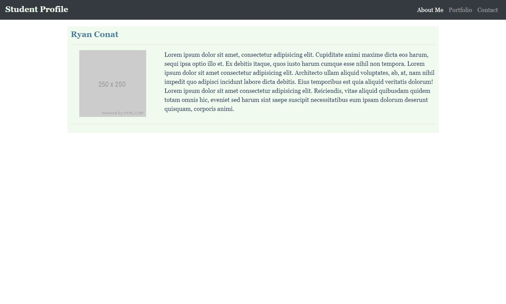
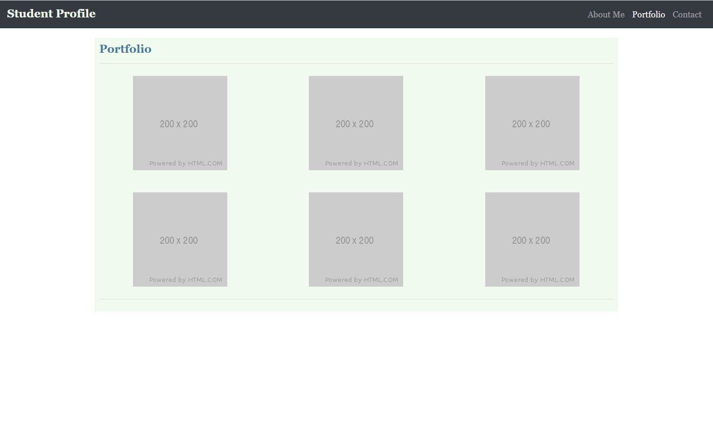
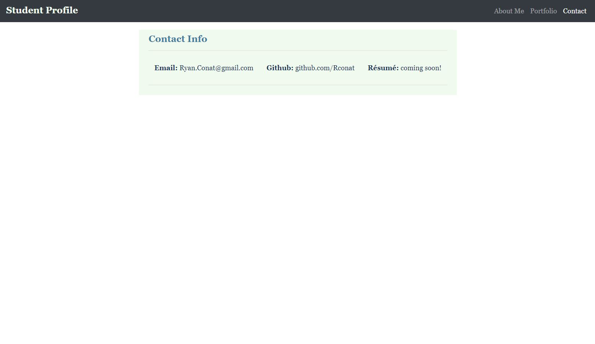

# rConat.github.io

## Description 

This project is a personal webpage to represent my coding work and projects. This will give me a good foundation to build upon as I further my coding education and begin to add projects and ideas to the site. The page provides the "bare bones" structure which will allow for easy modification later on. The page is responsive to three different media sizes and is intended to be viewable on full webpage, tablet, and mobile devices. 

 ---
## Webpage Hosting

The webpage is hosted on [GitHub](https://rconat.github.io).

You can find the repo on [GitHub](https://github.com/Rconat/rConat.github.io).

---

## Table of Contents

* [Images of Project](#Images-of-Project)
* [List of Files](#List-of-Files)
* [Usage](#usage)

------

## Images of Project

## List of Files

<ul>
    <li>index.html</li>
    <li>style.css</li>
    <li>README.md</li>
    <li>mainPageLayout.jpg</li>
    <li>portfolioLayout.jpg</li>
    <li>contactLayout.jpg</li>
</ul>

## Usage 

This will be continually developed as I learn more coding throughout my studies. I will be able to implement new designs as well as insert my projects as I complete more work. This will be my main github profile which will be easily accessible for future employers to view and get a feel for my work. This will also provide a profile for any other coders who would like to work with me on future github projects.

## Credits

For this assignment I used Bootstrap (http://www.getbootstrap.com) to easily provide the structure of the webpage and quickly iterate out the main elements of the webpage. The main elements I used from bootstrap was the navbar as well as bootstrap grid layout.

---

